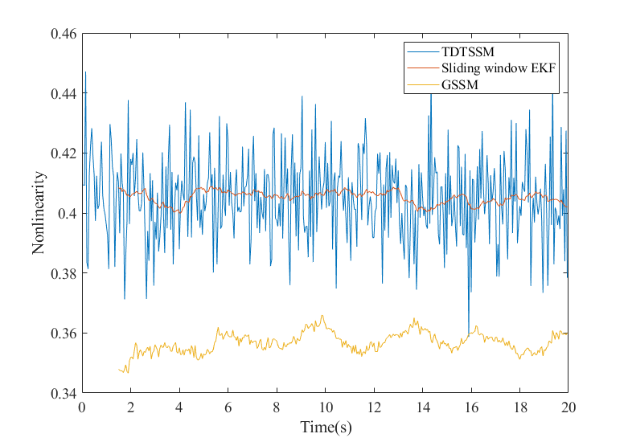

# GraphicalStateSpaceModel

This library contains the open source codes for the paper "Graphical State Space Model".
You can get a preprint version of this paper from https://arxiv.org/abs/2107.01602.
If you are interested in the application of GSSM on RTK, you may refer to https://github.com/shaolinbit/RTKinGSS
Degree of Nonlinearity analysis file is added for the paper "Real-time Kinematic Positioning Algorithm in Graphical State Space" which will be presented at ITM2023.
It is illustrated that DON of GSSM will be smalller than that of Traditional Discrete State Space Model.

## How to use this library

### 1)Required

- CMake --> sudo apt-get install cmake

- Boost   --> sudo apt-get install libboost-all-dev

- Eigen    --> sudo apt-get install libeigen3-dev

  ​					sudo cp -r /usr/local/include/eigen3 /usr/include

- Intel TBB (optional)->sudo apt-get install libtbb-dev

- [gtsam](https://github.com/borglab/gtsam)  --> git clone https://github.com/borglab/gtsam.git 

  and Install gtsam

- [IntelMkl](https://software.intel.com/content/www/us/en/develop/tools/oneapi/components/onemkl.html)(optional)

### 2)Clone repository to local machine

- GraphicalStateSpaceModel -->git clone https://github.com/shaolinbit/GraphicalStateSpaceModel.git

### 3)Build

​	cd GraphicalStateSpaceModel/src

​	mkdir build && cd build

​	cmake ..

​	make

### 4)Test

​	cd ..

​	cd bin

​	cp ../radardata2.txt ./

​	./GraphicalStateSpaceModel		

​

There will be a test result named "opresultradar.txt" in the bin file folder.

PS:Our test data is generated by "radartracking.m".Users could get other test data by change  this m file and run it by matlab.
